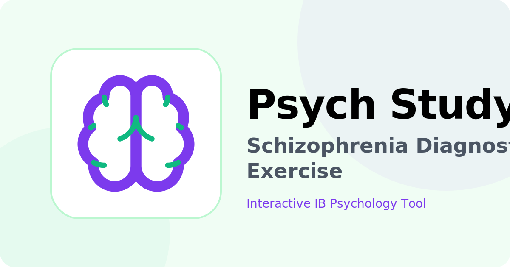

# Psych Experiment App

<p align="center">
  
</p>

A psychology experiment pairing activity app built with React, Vite, and Neon PostgreSQL database.

## Live Demo

Production: https://web-six-xi-89.vercel.app or https://psych.advay.ca

## Project Structure

```
.
├── api/
│   └── activity/
│       ├── admin.js      # Admin controls (start/next/reset)
│       ├── heartbeat.js  # Participant heartbeat updates
│       ├── join.js       # Join activity endpoint
│       └── state.js      # Get current activity state
├── src/
│   ├── pages/
│   │   ├── Activity.jsx  # Participant view
│   │   ├── Admin.jsx     # Admin controls
│   │   ├── Home.jsx      # Landing page
│   │   └── Learn.jsx     # Information page
│   ├── App.jsx           # App router
│   ├── main.jsx          # Entry point
│   └── index.css         # Global styles
├── scripts/
│   └── setup-db.js       # Database schema setup
└── vercel.json           # Vercel configuration
```

## API Endpoints

- `POST /api/activity/join` - Join the activity as a participant
- `GET /api/activity/state` - Get current activity state
- `POST /api/activity/heartbeat` - Update participant heartbeat
- `POST /api/activity/admin` - Admin actions (start/next/reset)

> im not even in psych im just doing this for shawarma lmao